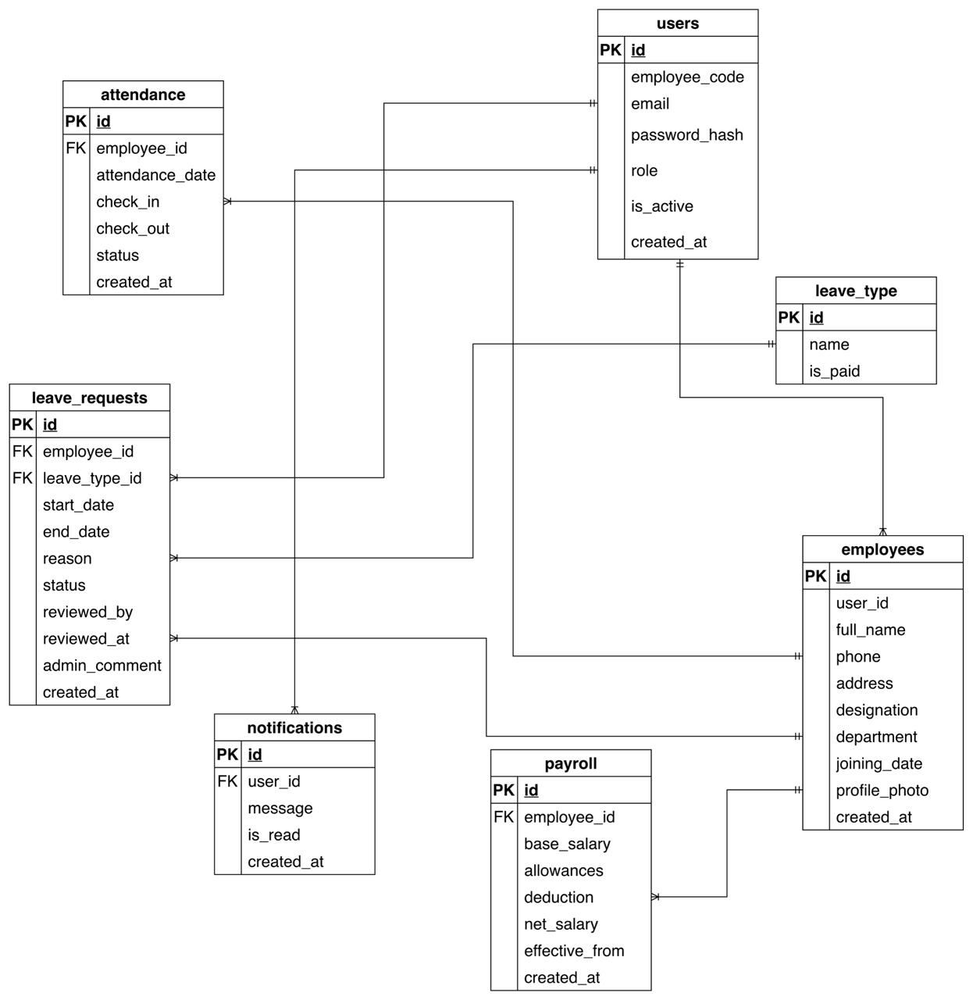

# DayFlow HRMS

DayFlow HRMS is a full-stack Human Resource Management System designed to manage employees, attendance, leaves, payroll, and users with secure role-based access.

The system supports Employees, HR, and Admin roles and provides a clean dashboard-driven workflow with real backend APIs and Swagger documentation.

---

## 🚀 Features

### 🔐 Authentication & Authorization
- JWT-based authentication
- Role-based access (ADMIN / HR / EMPLOYEE)
- Protected routes (frontend & backend)
- Secure API access using Bearer tokens

### 👥 Employee Management
- Create, view, update, delete employees
- View own profile
- Admin/HR access to all employees

### ⏱ Attendance Management
- Daily check-in & check-out
- Attendance history
- Admin/HR attendance overview
- Duplicate check-in prevention

### 🏖 Leave Management
- Apply for leave (Employee)
- View personal leave requests
- Admin/HR approve or reject leaves
- Leave types management

### 💰 Payroll Management
- Create payroll records
- View payroll (Admin / Employee)

### 📊 Dashboards
- Employee dashboard (attendance, leaves, payroll)
- Admin dashboard (employees, attendance, leaves)

### 📄 API Documentation
- Swagger UI with all routes documented

---

## 🧱 Tech Stack

### Frontend
- React
- React Router
- Axios
- Tailwind CSS
- Lucide Icons

### Backend
- Node.js
- Express.js
- MySQL
- JWT Authentication
- Swagger (OpenAPI)

---

## 📁 Folder Structure

### Backend (/backend)
```
backend/
│
├── src/
│   ├── config/
│   │   ├── db.js               # MySQL connection
│   │   ├── swagger.js          # Swagger config
│   │
│   ├── controllers/
│   │   ├── auth.controller.js
│   │   ├── employee.controller.js
│   │   ├── attendance.controller.js
│   │   ├── leave.controller.js
│   │   ├── leaveType.controller.js
│   │   ├── payroll.controller.js
│   │
│   ├── middleware/
│   │   ├── auth.middleware.js  # JWT verification
│   │   ├── role.middleware.js  # Role-based access
│   │
│   ├── routes/
│   │   ├── auth.routes.js
│   │   ├── employee.routes.js
│   │   ├── attendance.routes.js
│   │   ├── leave.routes.js
│   │   ├── leaveType.routes.js
│   │   ├── payroll.routes.js
│   │   ├── user.routes.js
│   │
│   ├── db/
│   │   └── mysql.js
│
├── server.js                   # App entry point
```

### Frontend (/frontend)
```
frontend/
│
├── src/
│   ├── api/                    # Axios API wrappers
│   │   ├── auth.api.js
│   │   ├── attendance.api.js
│   │   ├── employee.api.js
│   │   ├── leaves.api.js
│   │
│   ├── services/               # Business logic layer
│   │   ├── attendance.service.js
│   │   ├── employee.service.js
│   │   ├── leave.service.js
│   │
│   ├── auth/
│   │   ├── Login.jsx
│   │   ├── Register.jsx
│   │   ├── ProtectedRoute.jsx
│   │
│   ├── context/
│   │   └── AuthContext.js
│
│   ├── dashboard/
│   │   ├── EmployeeDashboard.jsx
│   │   ├── AdminDashboard.jsx
│
│   ├── pages/
│   │   ├── attendance/
│   │   │   └── AttendancePage.jsx
│   │   ├── leaves/
│   │   │   └── LeavePage.jsx
│   │   ├── profile/
│   │   │   └── ViewEmployeeProfile.jsx
│
│   ├── components/
│   │   ├── Sidebar.jsx
│   │   ├── Topbar.jsx
│   │   ├── EmployeeCard.jsx
│
│   ├── App.js
│   ├── index.js
```

---
## Entity-Relation Diagram


## 🔐 Authentication Flow

1. User logs in via `/auth/login`
2. Backend returns:
```json
{
  "token": "JWT_TOKEN",
  "role": "ADMIN | HR | EMPLOYEE"
}
```
3. Token is stored in AuthContext
4. Axios attaches token as:
```
Authorization: Bearer <token>
```
5. Protected routes verify JWT & role

---

## 📌 API Routes

### 🔑 Auth Routes
```
POST   /api/v1/auth/register
POST   /api/v1/auth/login
```

### 👤 Employees
```
GET    /api/v1/employees/me
GET    /api/v1/employees
POST   /api/v1/employees
GET    /api/v1/employees/:id
PUT    /api/v1/employees/:id
DELETE /api/v1/employees/:id
```

### ⏱ Attendance
```
POST   /api/v1/attendance/check-in
POST   /api/v1/attendance/check-out
GET    /api/v1/attendance/me
GET    /api/v1/attendance
GET    /api/v1/attendance/:employeeId
```

### 🏖 Leaves
```
POST   /api/v1/leaves
GET    /api/v1/leaves
GET    /api/v1/leaves/me
GET    /api/v1/leaves/:id
PUT    /api/v1/leaves/:id/decision
```

### 🗂 Leave Types
```
GET    /api/v1/leave-types
POST   /api/v1/leave-types
```

### 💰 Payroll
```
POST   /api/v1/payroll
GET    /api/v1/payroll
GET    /api/v1/payroll/me
```

### 👥 Users
```
GET    /api/v1/users/me
GET    /api/v1/users
PUT    /api/v1/users/:id/status
```

---

## 📘 Swagger Documentation (COMPULSORY)

DayFlow HRMS includes Swagger (OpenAPI) for full API documentation.

### 📍 Swagger URL
```
http://localhost:4000/api-docs
```

### What Swagger Provides
- Complete API listing
- Request/response schemas
- Authorization testing
- Role-based API visibility
- Live API execution

### How to Authorize in Swagger
1. Click **Authorize**
2. Enter:
```
Bearer <JWT_TOKEN>
```
3. Now test protected APIs

Swagger ensures:
- Backend contract clarity
- Easy frontend-backend integration
- API testing without Postman

---

## ⚙️ Environment Variables

### Backend (.env)
```env
PORT=4000
DB_HOST=localhost
DB_USER=root
DB_PASSWORD=yourpassword
DB_NAME=dayflow_hrms
JWT_SECRET=supersecretkey
```

### Frontend (.env)
```env
REACT_APP_API_BASE_URL=http://localhost:4000/api/v1
```

---

## 🛡 Security Notes

- JWT validation on every protected route
- Role-based middleware enforcement
- SQL injection safe queries
- Duplicate attendance prevention
- Token-based frontend API access

---

## ✅ Project Status

- ✔ Fully functional backend
- ✔ Real database integration
- ✔ Secure authentication
- ✔ Swagger documented APIs
- ✔ Scalable architecture

---

## 📌 Future Enhancements

- Attendance auto-absent marking
- Payroll PDF generation
- Email notifications
- Advanced analytics dashboards
- Two-factor authentication

---

## 📄 License

This project is licensed under the MIT License.

## 🤝 Contributing

Contributions, issues, and feature requests are welcome!

## 👨‍💻 Author

DayFlow HRMS Team
